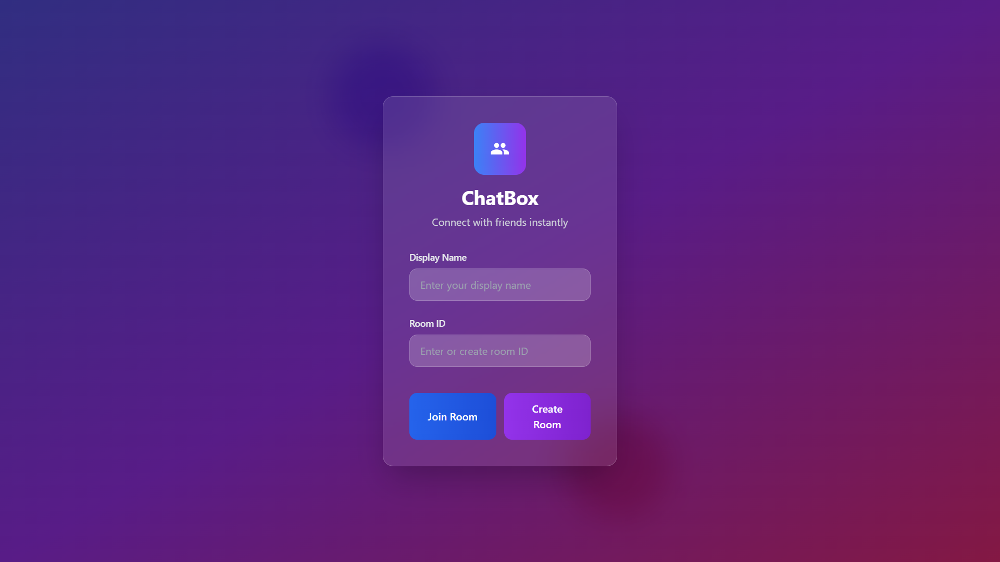
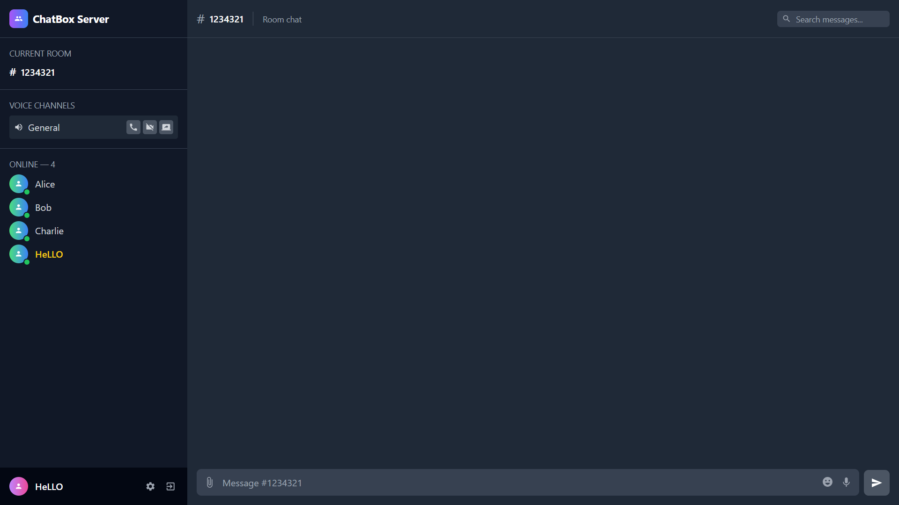

#     <p>     💬 ChatBox - Modern Real-Time Chat Application</p>

<div align="center">
  
  
  
  
</div>

<div align="center">
  <h3>🚀 A Discord-Inspired Chat Experience with Modern UI/UX</h3>
  <p>Real-time messaging • Voice & Video Calls • File Sharing • Beautiful Animations</p>
</div>

---

## ✨ Features at a Glance

### 🎨 **Visual Excellence**
- **Modern Gradient Backgrounds** with smooth animated elements
- **Glassmorphism Design** with backdrop blur effects and transparency
- **Discord-Inspired Dark Theme** for comfortable chatting
- **Responsive Design** that works on all devices
- **Smooth Animations** and hover effects throughout

### 💬 **Enhanced Messaging**
- **Real-time WebSocket Integration** for instant message delivery
- **Multiple Message Types** with rich formatting support
- **Emoji Picker** with quick selection and favorites
- **Message Search** functionality to find conversations
- **Auto-scroll** to latest messages
- **Timestamp Display** for message context
- **User Highlighting** for better conversation flow

### 🔊 **Voice & Video Features**
- **Voice Call Controls** with visual feedback indicators
- **Video Chat Interface** with camera toggle
- **Screen Sharing** capabilities for collaboration
- **Voice Message Recording** with playback controls
- **Call Status Indicators** showing connection state

### 📁 **File Sharing & Media**
- **Drag & Drop File Upload** with visual feedback
- **File Preview** before sending
- **Multiple File Format Support**
- **File Attachment Display** in chat
- **Progress Indicators** for uploads

### 👥 **User Management**
- **Online Users List** with real-time presence
- **User Avatars** and profile pictures
- **Status Indicators** (online, away, busy)
- **User Panel** with profile information
- **Room Management** for organized conversations

### 🎯 **User Experience**
- **Loading States** with beautiful animations
- **Toast Notifications** for user feedback
- **Keyboard Shortcuts** (Enter to send, etc.)
- **Error Handling** with graceful fallbacks
- **Optimized Performance** for smooth interactions

---

## 🏗️ Architecture

### 📂 **Core Components**

#### `JoinCreateChat.jsx`
- **Modern Landing Page** with gradient backgrounds
- **Glassmorphism Cards** for room creation/joining
- **Brand Identity** with ChatBox logo and description
- **Enhanced Styling** with hover animations and scale effects
- **Loading States** for better user experience

#### `ChatPage.jsx`
- **Complete Discord-like Interface** with sidebar layout
- **Voice & Video Controls** integrated seamlessly
- **File Sharing System** with drag-drop support
- **Enhanced Message Display** with rich formatting
- **User Management Panel** with online status
- **Real-time Features** powered by WebSocket

#### `ChatContext.jsx`
- **Clean React Context** implementation
- **Global State Management** for roomId, currentUser, and connection status
- **Provider Wrapper** for app-wide state access
- **Type-safe State Updates** with proper error handling

#### `RoomService.js`
- **API Service Layer** for backend communication
- **Room Operations** (create, join, leave)
- **Message Management** with pagination support
- **Error Handling** and response validation

---

## 🚀 Getting Started

### Prerequisites
```bash
Node.js (v14 or higher)
npm or yarn package manager
```

### Installation

1. **Clone the repository**
```bash
git clone https://github.com/yourusername/chatbox.git
cd chatbox
```

2. **Install dependencies**
```bash
npm install
# or
yarn install
```

3. **Set up environment variables**
```bash
# Create .env file in root directory
REACT_APP_API_URL=your_backend_url
REACT_APP_WEBSOCKET_URL=your_websocket_url
```

4. **Start the development server**
```bash
npm start
# or
yarn start
```

5. **Open your browser**
```
Navigate to http://localhost:3000
```

---

## 🛠️ Technology Stack

### **Frontend**
- **React 18** - Modern React with hooks and context
- **CSS3** - Custom styling with animations and transitions
- **WebSocket** - Real-time bidirectional communication
- **Context API** - State management across components

### **Key Libraries**
- **React Context** for global state management
- **WebSocket API** for real-time messaging
- **File API** for file upload and preview
- **Canvas API** for voice message visualization

### **Design System**
- **Glassmorphism** - Modern UI trend with backdrop blur
- **Dark Theme** - Easy on the eyes for long conversations
- **Gradient Backgrounds** - Beautiful visual appeal
- **Responsive Grid** - Adapts to all screen sizes

---

🎨 Joining Page
Beautiful glassmorphism design with animated gradients and smooth transitions
<div align="center">
  
  <p><em>Modern glassmorphism join/create room interface with gradient backgrounds</em></p>
</div>
💬 Chat Interface
Discord-inspired layout with sidebar, message area, and user panel
<div align="center">
  
  <p><em>Full-featured chat interface with voice controls, file sharing, and user management</em></p>
</div>

---

## 🎯 Usage Guide

### **Creating a Room**
1. Enter a unique room name
2. Click "Create Room" button
3. Share the room ID with friends

### **Joining a Room**
1. Enter the room ID you received
2. Click "Join Room" button
3. Start chatting immediately

### **Sending Messages**
- Type your message and press Enter
- Use @ to mention users
- Add emojis with the emoji picker
- Share files by dragging and dropping

### **Voice Features**
- Click the microphone to start voice chat
- Use video button for video calls
- Screen share for presentations
- Record voice messages for async communication

---

## 🔧 Configuration

### **WebSocket Setup**
```javascript
// Update your WebSocket URL in the environment
REACT_APP_WEBSOCKET_URL=ws://localhost:8080
```

### **API Configuration**
```javascript
// Set your backend API URL
REACT_APP_API_URL=http://localhost:3000/api
```

### **Customization**
- Modify colors in CSS custom properties
- Update brand logo and description
- Customize animation timings and effects
- Add new message types and formatting

---

## 🤝 Contributing

We welcome contributions! Here's how you can help:

1. **Fork the repository**
2. **Create a feature branch** (`git checkout -b feature/amazing-feature`)
3. **Commit your changes** (`git commit -m 'Add amazing feature'`)
4. **Push to the branch** (`git push origin feature/amazing-feature`)
5. **Open a Pull Request**

### **Contribution Guidelines**
- Follow the existing code style
- Add comments for complex logic
- Test your changes thoroughly
- Update documentation as needed

---

## 📝 License

This project is licensed under the MIT License - see the [LICENSE](LICENSE) file for details.

---

## 🙏 Acknowledgments

- **React Team** for the amazing framework
- **Discord** for UI/UX inspiration
- **Glassmorphism Community** for design trends
- **Open Source Community** for continuous inspiration

---

## 📞 Support & Contact

- **Issues**: [GitHub Issues](https://github.com/yourusername/chatbox/issues)
- **Discussions**: [GitHub Discussions](https://github.com/yourusername/chatbox/discussions)
- **Email**: your.email@example.com

---

<div align="center">
  <h3>🌟 Star this repository if you found it helpful!</h3>
  <p>Made with ❤️ by developers, for developers</p>
  
  
  
  
</div>

---

## 🔄 Version History

### v1.0.0 (Latest)
- ✅ Initial release with full chat functionality
- ✅ Discord-inspired UI with glassmorphism design
- ✅ Voice and video call features
- ✅ File sharing with drag-drop support
- ✅ Real-time messaging with WebSocket
- ✅ User management and online status
- ✅ Mobile responsive design

### Coming Soon
- 🔜 Message reactions and threading
- 🔜 Custom emoji support
- 🔜 Voice channel creation
- 🔜 Advanced file sharing options
- 🔜 Message encryption
- 🔜 User roles and permissions

---

*Happy Chatting! 💬✨*
